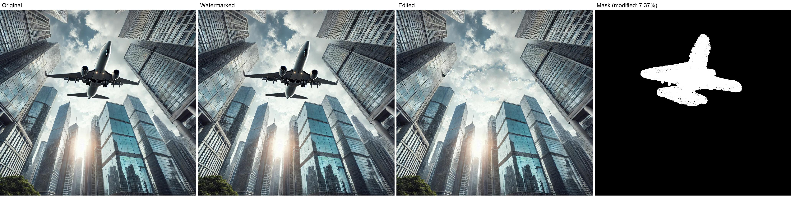
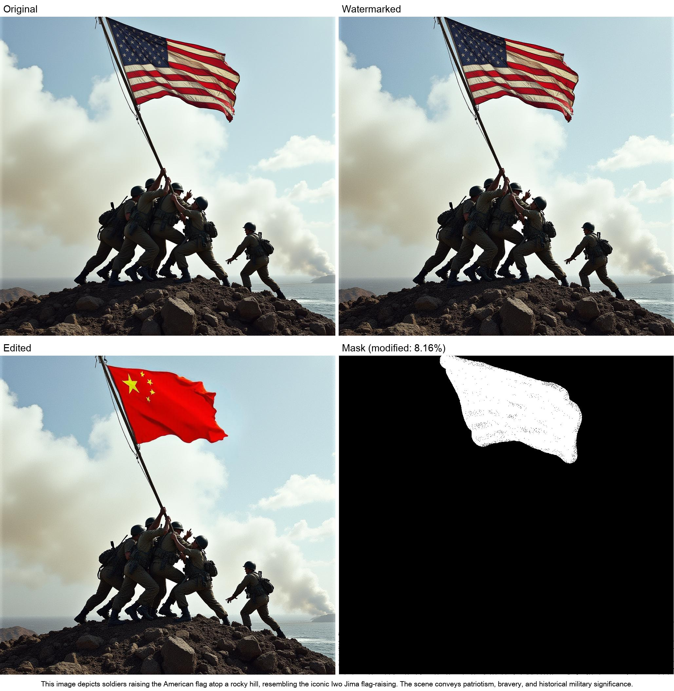
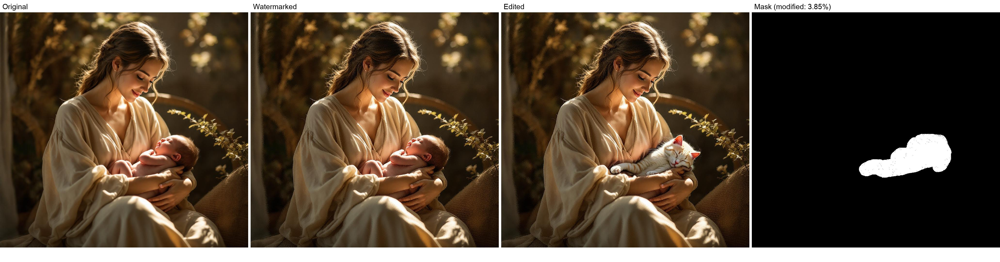
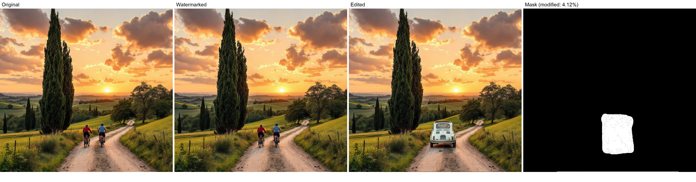
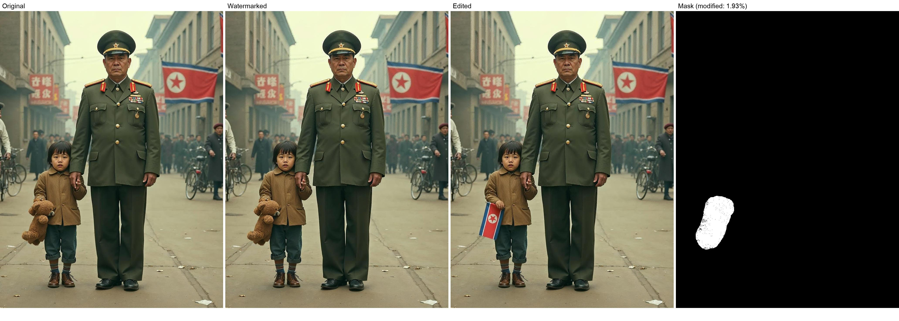
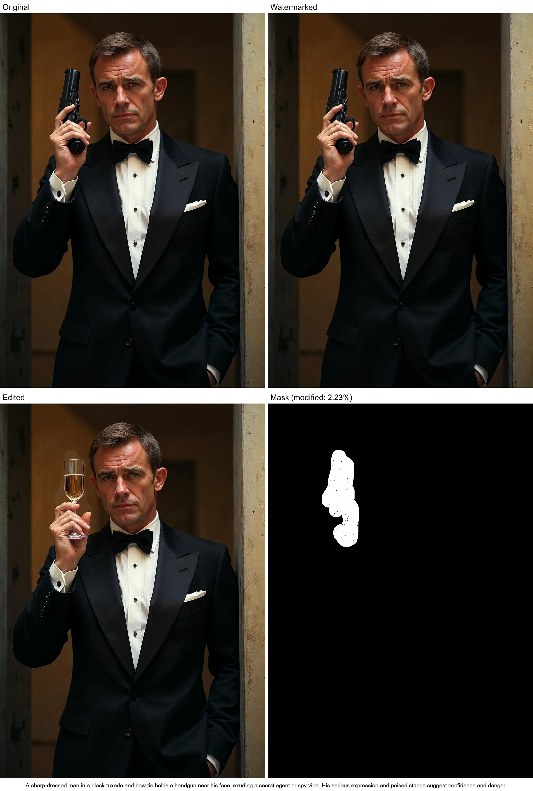
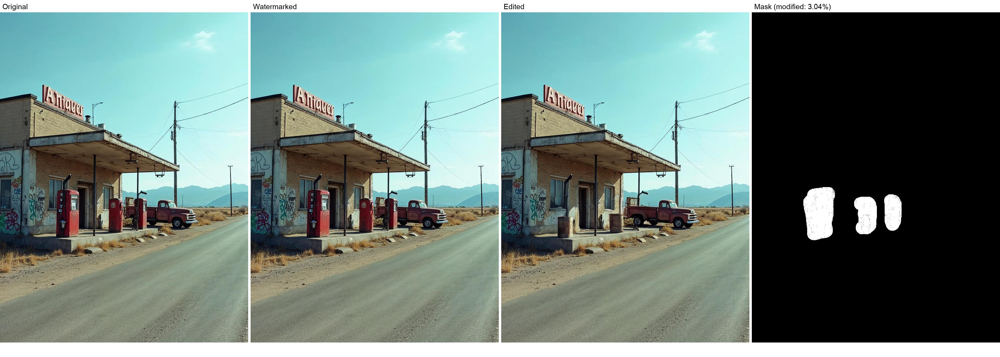
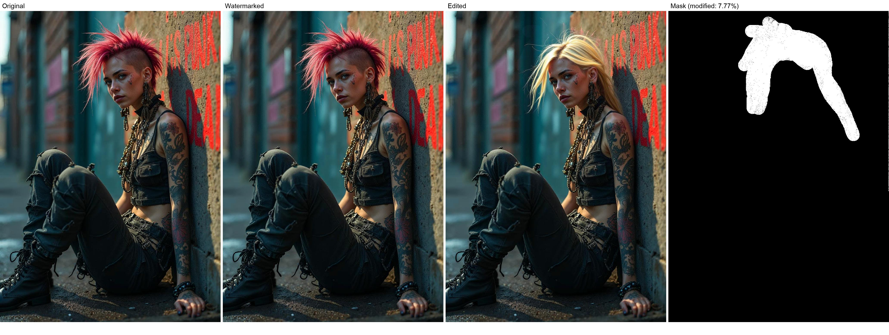
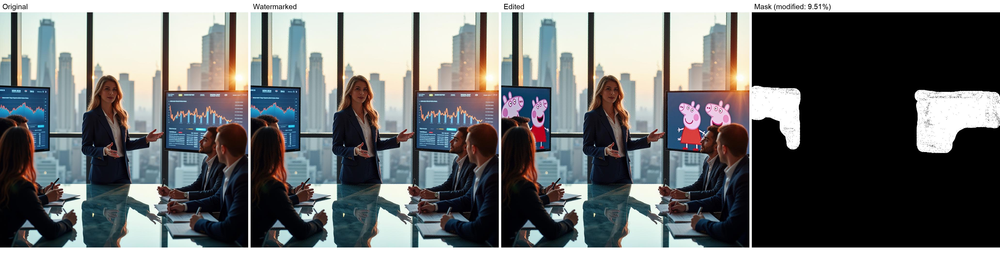
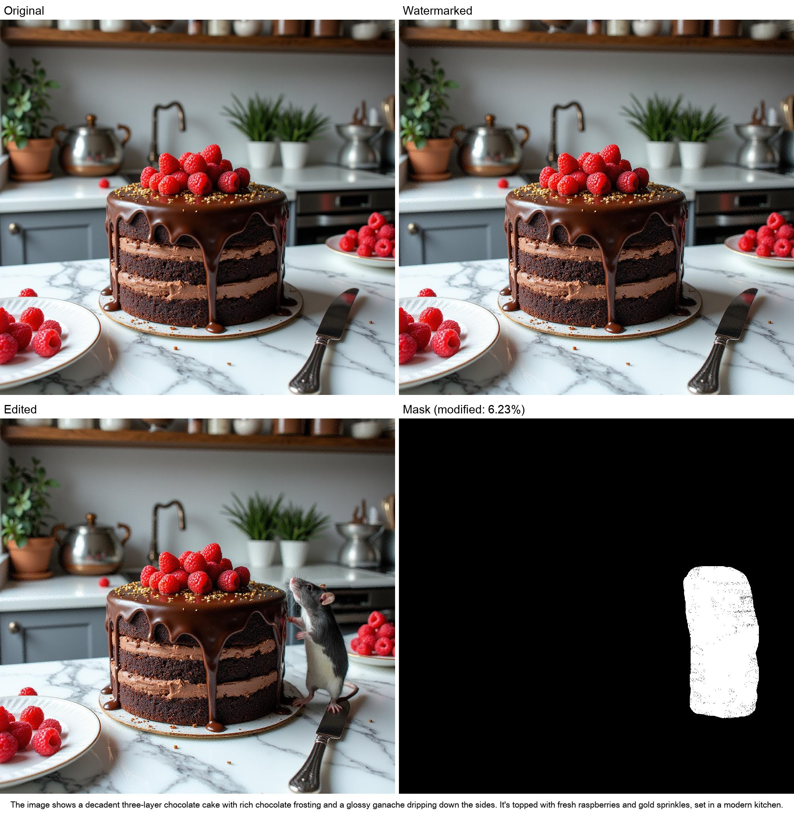

# OFSemWat
OF-SemWat: robust semantic text watermarking of ai-generated images of arbitrary resolution

# Summary 

1. [Algorithm implementation](#algorithm-implementation)
2. [AI based inpainting examples](#ai-based-inpainting-examples)
   1. [Examples](#examples)
   2. [Watermark recovery](#watermark-recovery)
3. [Additional results](#additional-results)

# Algorithm implementation

Available soon!

# AI based inpainting examples

## Examples

For each image, from left to right, we show:
- The input, to-be-watermarked image
- The watermarked image. The embedded watermark is a brief description of the image itself (200 characters) encoded to a binary sequence of 1000 bits. Below each sequence of figures we report the textual version of the watermark.
- The watermarked, edited image. Specifically, the image was semantically modified using prompt-based AI inpainting within [Freepik's AI suite](https://www.freepik.com/pikaso/image-editor).
- A binary mask highlighting the modified region. This mask is the binarised difference between watermarked and edited image, without further morphological operators. Above the mask, we report the percentage of modified pixels.

### AI inpainting 1

Embedded watermark:
>An airplane flies low near modern skyscrapers in a dense city. The glass buildings reflect sunlight, and the sky is partly cloudy. The perspective emphasizes the dramatic proximity of the plane and towers.

### AI inpainting 2

Embedded watermark:
>This image depicts soldiers raising the American flag atop a rocky hill, resembling the iconic Iwo Jima flag-raising. The scene conveys patriotism, bravery, and historical military significance.

### AI inpainting 3

Embedded watermark:
>A serene young woman in a flowing beige gown, sitting and cradling a newborn baby in her lap. Warm sunlight filters through, casting a soft glow, evoking classic Madonna and Child iconography.

### AI inpainting 4

Prompt
>Two cyclists ride along a winding dirt road through rolling green hills at sunset. Tall cypress trees frame the scene, with golden light casting a warm glow over the landscape and scattered clouds above.

### AI inpainting 5

Embedded watermark:
>The image depicts a stern military officer in a decorated green uniform holding hands with a young child clutching a teddy bear. The setting appears historical, with a North Korean flag and vintage street signs.

### AI inpainting 6

Embedded watermark:
>A sharp-dressed man in a black tuxedo and bow tie holds a handgun near his face, exuding a secret agent or spy vibe. His serious expression and poised stance suggest confidence and danger.

### AI inpainting 7

Embedded watermark:
>An old, abandoned gas station with faded red pumps and graffiti-covered walls sits along a desolate road. A vintage red pickup truck is parked nearby, with mountains in the background under a clear sky.

### AI inpainting 8

Embedded watermark:
>A rebellious woman with a striking pink mohawk sits against a graffiticovered wall dressed in ripped black clothing adorned with tattoos and layered jewelry she exudes a fierce and edgy punk aesthetic.

### AI inpainting 9

Embedded watermark:
>The image shows a businesswoman leading a presentation in a high-rise office at sunset, with graphs on screens behind her. She addresses a group of professionals seated around a glass conference table.

### AI inpainting 10

Embedded watermark:
>The image shows a decadent three-layer chocolate cake with rich chocolate frosting and a glossy ganache dripping down the sides. It's topped with fresh raspberries and gold sprinkles, set in a modern kitchen.

## Watermark recovery

| Image | Size | Watermark_orig | BER (%) | Bit errors | 
|-----|------|----------------|---------|------------|
|  1  |  1024x1024|An airplane flies low near modern skyscrapers in a dense city. The glass buildings reflect sunlight, and the sky is partly cloudy. The perspective emphasizes the dramatic proximity of the plane and towers.| 0.00| 0/1024|            
|  2  |1024x1024|This image depicts soldiers raising the American flag atop a rocky hill, resembling the iconic Iwo Jima flag-raising. The scene conveys patriotism, bravery, and historical military significance.| 0.00| 0/1024|            
|  3  |1024x1024|A serene young woman in a flowing beige gown, sitting and cradling a newborn baby in her lap. Warm sunlight filters through, casting a soft glow, evoking classic Madonna and Child iconography.| 0.00| 0/1024|            
|  4  |1024x1024|Two cyclists ride along a winding dirt road through rolling green hills at sunset. Tall cypress trees frame the scene, with golden light casting a warm glow over the landscape and scattered clouds above.| 0.00| 0/1024|            
|  5  |1024x1024|The image depicts a stern military officer in a decorated green uniform holding hands with a young child clutching a teddy bear. The setting appears historical, with a North Korean flag and vintage street signs.| 0.00| 0/1024|            
|  6  |1024x1024|A sharp-dressed man in a black tuxedo and bow tie holds a handgun near his face, exuding a secret agent or spy vibe. His serious expression and poised stance suggest confidence and danger.| **1.37**| **14/1024**|            
|  7  |1024x1024|An old, abandoned gas station with faded red pumps and graffiti-covered walls sits along a desolate road. A vintage red pickup truck is parked nearby, with mountains in the background under a clear sky.| 0.00| 0/1024|            
|  8  |1024x1496|A rebellious woman with a striking pink mohawk sits against a graffiti-covered wall. Dressed in ripped black clothing, adorned with tattoos and layered jewelry, she exudes a fierce and edgy punk aesthetic.| 0.00| 0/1024|            
|  9  |1024x1024|The image shows a businesswoman leading a presentation in a high-rise office at sunset, with graphs on screens behind her. She addresses a group of professionals seated around a glass conference table.| 0.00| 0/1024|            
|  10 |1024x1024|The image shows a decadent three-layer chocolate cake with rich chocolate frosting and a glossy ganache dripping down the sides. It's topped with fresh raspberries and gold sprinkles, set in a modern kitchen.| 0.00| 0/1024|   

## Additional results

ontrary to popular belief, Lorem Ipsum is not simply random text. It has roots in a piece of classical Latin literature from 45 BC, making it over 2000 years old. Richard McClintock, a Latin professor at Hampden-Sydney College in Virginia, 
looked up one of the more obscure Latin words, consectetur, from a Lorem Ipsum passage, and going through the cites of the word in classical literature, discovered the undoubtable source. Lorem Ipsum comes from sections 1.10.32 and 1.10.33 of "de Finibus Bonorum et Malorum" (The Extremes of Good and Evil) by Cicero, written in 45 BC. This book is a treatise on the theory of ethics, very popular during the Renaissance. The first line of Lorem Ipsum, "Lorem ipsum dolor sit amet..", comes from a line in section 1.10.32.

| Image | Ber | Processing | Parameter | Sim_orig_gpt | Sim_orig_rec | Delta_sim | BER |
|-------|-----|------------|-----------|--------------|--------------|-----------|-----|
| 8     | 23  | ROTATE     | 5.0       | 0,054        | 0,0060       | 0,048     | 23  |
| 7     | 22  | ROTATE     | -10.0     | 0,370        | 0,1559       | 0,214     | 22  |
| 5     | 21  | JPEG       | 30.0      | 0,244        | 0,3386       | -0,095    | 21  |
| 7     | 19  | RESIZE     | 1.7       | 0,347        | 0,2233       | 0,123     | 19  |
| 5     | 19  | ROTATE     | 20.0      | 0,310        | 0,2718       | 0,038     | 19  |
| 4     | 19  | ADVCROP    | 35.0      | 0,129        | 0,2618       | -0,132    | 19  |
| 5     | 18  | RESIZE     | 1.2       | 0,692        | 0,2015       | 0,490     | 18  |
| 8     | 18  | ROTATE     | -5.0      | 0,534        | 0,2925       | 0,242     | 18  |
| 2     | 18  | ADVCROP    | 20.0      | 0,370        | 0,2318       | 0,139     | 18  |
| 6     | 18  | RESIZE     | 1.5       | 0,010        | 0,3026       | -0,293    | 18  |
| 6     | 18  | RESIZE     | 1.1       | 0,092        | 0,0753       | 0,017     | 18  |
| 6     | 18  | JPEG       | 80.0      | 0,074        | 0,2038       | -0,130    | 18  |
| 5     | 17  | ROTATE     | -20.0     | 0,399        | 0,3371       | 0,061     | 17  |
| 8     | 17  | ADVCROP    | 20.0      | 0,021        | 0,2058       | -0,184    | 17  |
| 8     | 16  | JPEG       | 40.0      | 0,472        | 0,2088       | 0,263     | 16  |
| 6     | 16  | RESIZE     | 1.7       | 0,033        | 0,2242       | -0,192    | 16  |
| 2     | 15  | JPEG       | 30.0      | 0,800        | 0,2649       | 0,535     | 15  |
| 9     | 15  | ROTATE     | 5.0       | 0,647        | 0,2843       | 0,363     | 15  |
| 9     | 15  | ROTATE     | -10.0     | 0,500        | 0,1512       | 0,349     | 15  |
| 5     | 15  | RESIZE     | 1.7       | 0,578        | 0,1891       | 0,389     | 15  |
| 9     | 15  | ROTATE     | 10.0      | 0,442        | 0,3739       | 0,068     | 15  |
| 3     | 15  | JPEG       | 20.0      | 0,536        | 0,2620       | 0,274     | 15  |
| 5     | 14  | ADVCROP    | 30.0      | 0,066        | 0,3677       | -0,302    | 14  |
| 2     | 14  | RESIZE     | 1.5       | 0,085        | 0,0823       | 0,003     | 14  |
| 6     | 13  | RESIZE     | 0.9       | 0,636        | 0,2603       | 0,376     | 13  |
| 7     | 13  | ADVCROP    | 30.0      | 0,514        | 0,2224       | 0,292     | 13  |
| 2     | 13  | RESIZE     | 1.7       | 0,085        | 0,1258       | -0,040    | 13  |
| 9     | 12  | ROTATE     | -5.0      | 0,892        | 0,5364       | 0,355     | 12  |
| 8     | 12  | RESIZE     | 0.9       | 0,887        | 0,2524       | 0,635     | 12  |
| 5     | 12  | ROTATE     | 15.0      | 0,837        | 0,2746       | 0,562     | 12  |
| 3     | 12  | ADVCROP    | 35.0      | 0,839        | 0,4493       | 0,390     | 12  |
| 7     | 11  | ROTATE     | -5.0      | 0,756        | 0,4986       | 0,257     | 11  |
| 7     | 11  | ROTATE     | 5.0       | 0,737        | 0,2965       | 0,440     | 11  |
| 8     | 10  | RESIZE     | 0.7       | 0,912        | 0,3353       | 0,577     | 10  |
| 8     | 9   | JPEG       | 50.0      | 0,998        | 0,3853       | 0,613     | 9   |
| 9     | 9   | JPEG       | 40.0      | 0,974        | 0,5039       | 0,470     | 9   |
| 5     | 9   | ROTATE     | -15.0     | 0,925        | 0,5236       | 0,401     | 9   |
| 4     | 8   | ROTATE     | 20.0      | 0,969        | 0,6952       | 0,273     | 8   |
| 1     | 8   | ROTATE     | -15.0     | 0,928        | 0,4215       | 0,507     | 8   |
| 6     | 8   | RESIZE     | 1.2       | 0,668        | 0,5807       | 0,087     | 8   |
| 4     | 7   | ROTATE     | -20.0     | 0,988        | 0,4525       | 0,536     | 7   |
| 5     | 7   | JPEG       | 40.0      | 0,992        | 0,4638       | 0,528     | 7   |
| 1     | 6   | ADVCROP    | 20.0      | 0,970        | 0,5426       | 0,427     | 6   |
| 1     | 6   | ROTATE     | 15.0      | 0,968        | 0,5689       | 0,399     | 6   |
| 2     | 6   | JPEG       | 40.0      | 0,891        | 0,7012       | 0,190     | 6   |
| 8     | 5   | JPEG       | 60.0      | 0,995        | 0,6522       | 0,343     | 5   |
| 6     | 5   | JPEG       | 90.0      | 0,862        | 0,5812       | 0,281     | 5   |
| 7     | 5   | RESIZE     | 1.5       | 0,992        | 0,5130       | 0,479     | 5   |
| 10    | 5   | ADVCROP    | 40.0      | 0,996        | 0,6765       | 0,320     | 5   |
| 6     | 5   | RESIZE     | 1.3       | 0,910        | 0,7356       | 0,175     | 5   |
| 4     | 5   | ADVCROP    | 30.0      | 0,968        | 0,6691       | 0,299     | 5   |
| 3     | 5   | RESIZE     | 1.5       | 1,000        | 0,8189       | 0,181     | 5   |
| 4     | 4   | RESIZE     | 1.2       | 0,999        | 0,6553       | 0,344     | 4   |
| 5     | 4   | ROTATE     | 10.0      | 0,999        | 0,7082       | 0,291     | 4   |
| 3     | 4   | RESIZE     | 1.7       | 0,972        | 0,7148       | 0,257     | 4   |
| 7     | 4   | JPEG       | 30.0      | 0,934        | 0,6884       | 0,246     | 4   |
| 2     | 4   | JPEG       | 50.0      | 0,856        | 0,8159       | 0,040     | 4   |
| 9     | 3   | JPEG       | 50.0      | 0,974        | 0,8131       | 0,161     | 3   |
| 5     | 3   | ROTATE     | -10.0     | 0,982        | 0,7422       | 0,240     | 3   |
| 2     | 3   | JPEG       | 60.0      | 0,999        | 0,7745       | 0,224     | 3   |
| 9     | 3   | ADVCROP    | 20.0      | 0,998        | 0,8593       | 0,139     | 3   |
| 3     | 3   | ADVCROP    | 30.0      | 0,994        | 0,8828       | 0,112     | 3   |
| 4     | 3   | ROTATE     | -15.0     | 0,982        | 0,8949       | 0,087     | 3   |
| 7     | 2   | ADVCROP    | 20.0      | 0,992        | 0,9295       | 0,063     | 2   |
| 1     | 2   | ROTATE     | 10.0      | 1,000        | 0,7358       | 0,264     | 2   |
| 2     | 2   | RESIZE     | 0.9       | 0,999        | 0,7567       | 0,242     | 2   |
| 9     | 2   | RESIZE     | 0.9       | 0,998        | 0,7778       | 0,220     | 2   |
| 8     | 2   | ADVCROP    | 10.0      | 0,997        | 0,8263       | 0,171     | 2   |
| 8     | 2   | RESIZE     | 0.8       | 0,997        | 0,8293       | 0,168     | 2   |
| 5     | 2   | ROTATE     | 5.0       | 0,999        | 0,8351       | 0,164     | 2   |
| 9     | 2   | RESIZE     | 0.7       | 0,992        | 0,8412       | 0,151     | 2   |
| 5     | 2   | RESIZE     | 1.5       | 0,999        | 0,8624       | 0,137     | 2   |
| 2     | 2   | RESIZE     | 0.7       | 1,000        | 0,9300       | 0,070     | 2   |
| 1     | 2   | ROTATE     | -10.0     | 0,829        | 0,9547       | -0,125    | 2   |
| 8     | 2   | RESIZE     | 1.1       | 0,963        | 0,9066       | 0,056     | 2   |
| 10    | 1   | JPEG       | 20.0      | 0,981        | 0,7271       | 0,253     | 1   |
| 3     | 1   | ROTATE     | -20.0     | 0,994        | 0,6602       | 0,333     | 1   |
| 8     | 1   | JPEG       | 70.0      | 0,997        | 0,8276       | 0,170     | 1   |
| 1     | 1   | JPEG       | 20.0      | 0,999        | 0,8323       | 0,167     | 1   |
| 4     | 1   | RESIZE     | 1.5       | 0,999        | 0,8380       | 0,161     | 1   |
| 3     | 1   | RESIZE     | 1.2       | 0,995        | 0,8444       | 0,151     | 1   |
| 4     | 1   | RESIZE     | 1.7       | 1,000        | 0,8750       | 0,125     | 1   |
| 8     | 1   | RESIZE     | 1.7       | 0,998        | 0,8842       | 0,114     | 1   |
| 8     | 1   | RESIZE     | 1.5       | 0,997        | 0,8880       | 0,109     | 1   |
| 4     | 1   | ROTATE     | 15.0      | 0,999        | 0,8995       | 0,100     | 1   |
| 5     | 1   | ROTATE     | -5.0      | 0,999        | 0,9024       | 0,097     | 1   |
| 7     | 1   | ADVCROP    | 10.0      | 0,992        | 0,9036       | 0,089     | 1   |
| 5     | 1   | ADVCROP    | 20.0      | 0,999        | 0,9012       | 0,098     | 1   |
| 6     | 1   | JPEG       | 100.0     | 0,981        | 0,9233       | 0,058     | 1   |
| 3     | 1   | JPEG       | 30.0      | 0,999        | 0,9094       | 0,089     | 1   |
| 2     | 1   | RESIZE     | 0.8       | 0,999        | 0,9311       | 0,067     | 1   |
| 10    | 1   | ADVCROP    | 35.0      | 1,000        | 0,9440       | 0,056     | 1   |
| 2     | 1   | RESIZE     | 1.1       | 0,999        | 0,9466       | 0,052     | 1   |
| 2     | 1   | ADVCROP    | 10.0      | 0,999        | 0,9554       | 0,043     | 1   |
| 7     | 1   | RESIZE     | 0.7       | 0,925        | 0,9591       | -0,034    | 1   |
